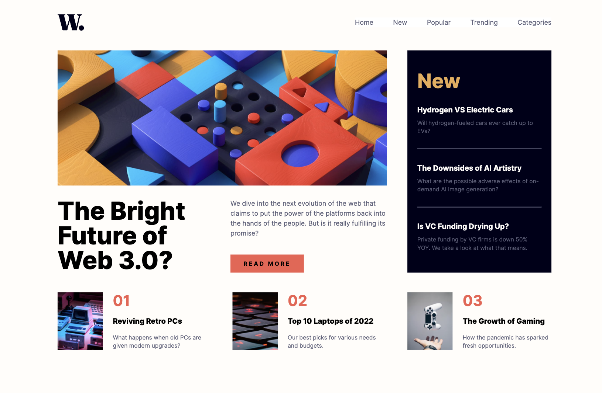

# Frontend Mentor - News homepage solution

This is a solution to the [News homepage challenge on Frontend Mentor](https://www.frontendmentor.io/challenges/news-homepage-H6SWTa1MFl). Frontend Mentor challenges help you improve your coding skills by building realistic projects.

## Table of contents

- [Overview](#overview)
  - [The challenge](#the-challenge)
  - [Screenshot](#screenshot)
  - [Links](#links)
- [My process](#my-process)
  - [Built with](#built-with)
- [Author](#author)

**Note: Delete this note and update the table of contents based on what sections you keep.**

## Overview

### The challenge

Users should be able to:

- View the optimal layout for the interface depending on their device's screen size
- See hover and focus states for all interactive elements on the page

### Screenshot

### Links

- Solution URL: [https://github.com/VaskaDaGama26/NewsMainpage](https://github.com/VaskaDaGama26/NewsMainpage)
- Live Site URL: [https://vaskadagama26.github.io/NewsMainpage/](https://vaskadagama26.github.io/NewsMainpage/)

## My process

### Built with

- Semantic HTML5 markup
- [TailwindCSS](https://tailwindcss.com/) - CSS Framework
- Flexbox
- [Vite](https://vite.dev/) - build tool

## Author

- TG - [Vasiliy Kirichenko](https://t.me/vaskadagamaa26)
- Frontend Mentor - [VaskaDaGama26](https://www.frontendmentor.io/profile/VaskaDaGama26)
